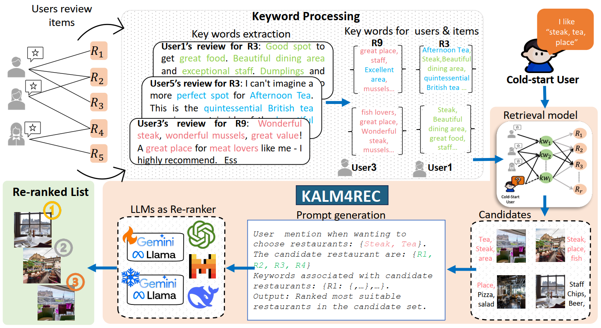

# KALM4Rec
## Keyword-driven Retrieval-Augmented Large Language Models for Cold-start User Recommendations 
<p align="center">

</p>

## Project Adaptation Notes

For the Nigerian-focused Yelp restaurant, Amazon cross-domain, cold-start methodology, and Chapter 3/4 experimental write-up, see:

- [docs/chapter_3_4_readme.md](docs/chapter_3_4_readme.md)
- [docs/task_b_kalm4rec_naija.md](docs/task_b_kalm4rec_naija.md)
- [docs/submission_api.md](docs/submission_api.md)

## Containerized Task B API

Build and run the persona recommendation API:

```bash
docker build -t naijarec-coldstart .
docker run --rm -p 8001:8001 naijarec-coldstart
```

Then open `http://localhost:8001/docs` or call `POST /recommend`.

## Dependencies
```
spacy, DGL, 
```
##  Required Files:
```
tripAdvisor: tripAdvisor.txt, hotel.txt

all: split.json


```

### Stage 1: Keyword extraction and Processing
```
# if using amazon and tripAdvisor:
python convert.py --city tripAdvisor

# extract keyword
python .\extractor.py --edgeType IUF --city singapore --kwExtractor kw_NLTK

# Download train: train is filtered file at ./data/preprocessed/by_city-users_min_3_reviews/keywords_spacy-min_3/train) then rename as: {city}-keyword_train.json
# Download test: train is filtered file at ./data/preprocessed/by_city-users_min_3_reviews/keywords_spacy/test) then rename as: {city}-keyword_test.json
# move those train/test keywords file to ./data/keywords directory

# Download irf and tf_irf;  rename as {city}-keyword-IRF.json {city}-keyword-TFIRF.json ; move to  ./data/score/{city}-keyword-TFIRF.json
# Download iuf and tf_iuf;  rename as {city}-keyword-IUF.json {city}-keyword-TFIUF.json ; move to  ./data/score/{city}-keyword-TFIUF.json
# remember to delete all files 
```

### Stage 2: Generate candidates

```

# MPG
python retrieval.py --city singapore --edgeType IUF

```

#### Args
> `edgeType`: build a KNN model to obtain most similar keyword in case of missing for testing user.
>
> `tuningData`: boolean, export tuning data or not


#### Results for retrieval models:
| city      | P@20        | R@20          |
| :----:    |    :----:   |    :----:     |
| 		    | 0.15        |   0.42        |

### Stage 3: Recommend by LLMs

#### Stage 3.1: check result

```

# make sure run and export for rerank:
python retrieval.py --city singapore --edgeType IUF --export2LLMs

# check result of retrieval:
python info.py --city singapore

```

```

# reranker
<!-- if using fewshots -->
python reRanker/create_sample_fewshot.py --city singapore 


python reRanker/rerank.py --city singapore --api_key {YOUR_API_KEY}

```

#### Args
> `type_method`: zeroshot, 1_shot, 2_shots, 3_shots.
>
> `num_kws_user`
>
> `num_kws_rest`
>
> `city`: 'edinburgh', 'london', 'singapore', 'tripAdvisor', 'baby', 'videos'
>
> `tuningData`: boolean, export tuning data or not
>
> `type_LLM`: gemini_pro, chatGPT
>
> `api_key`: your API key


## Dataset:
```
Yelp, Tripadvisor
Link: https://www.cs.cmu.edu/~jiweil/html/hotel-review.html
```
